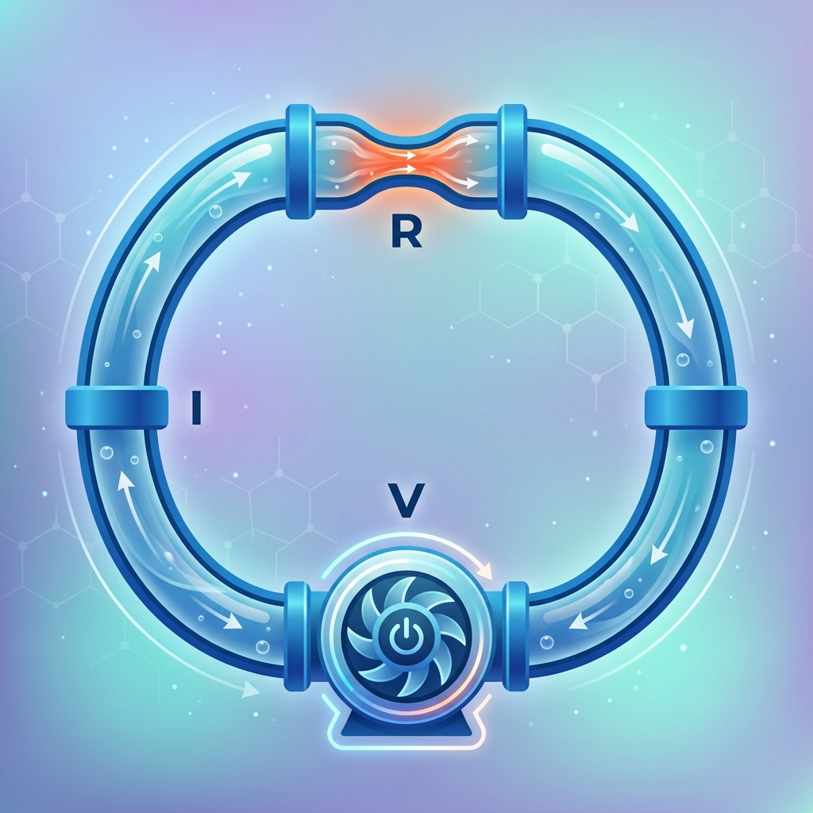
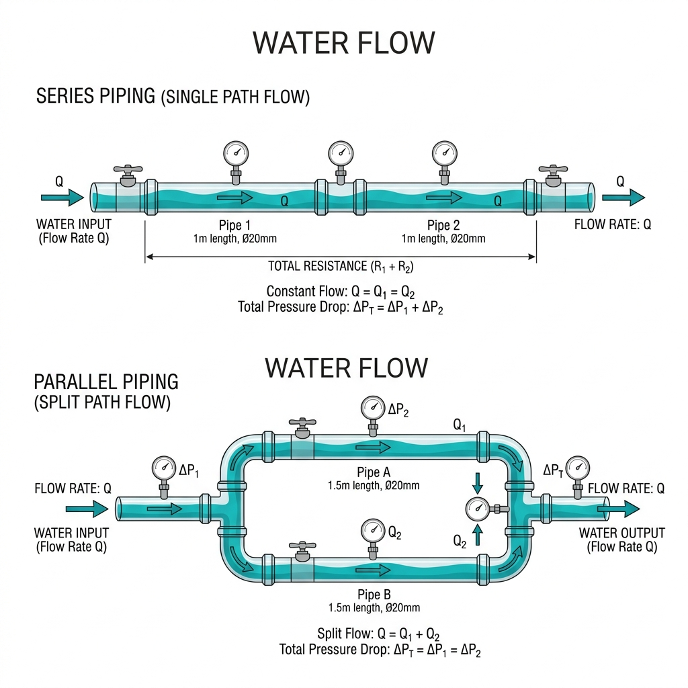
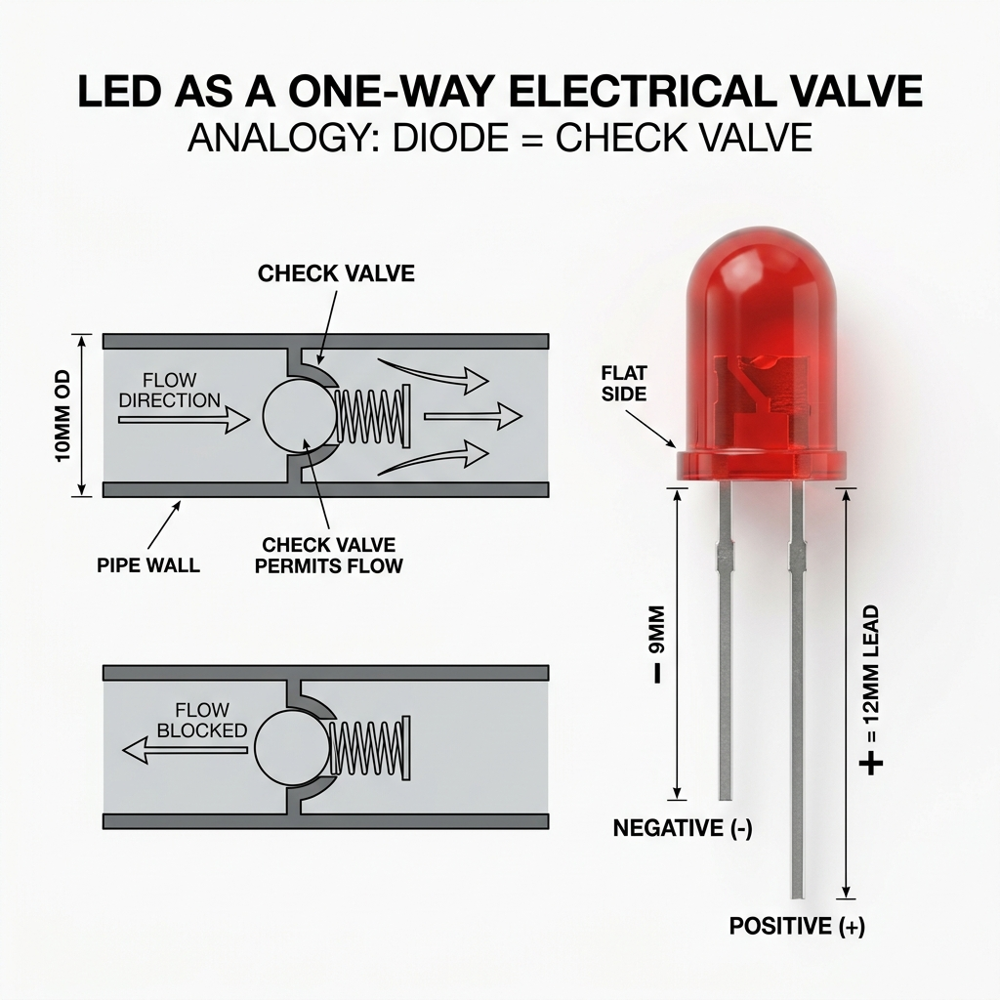
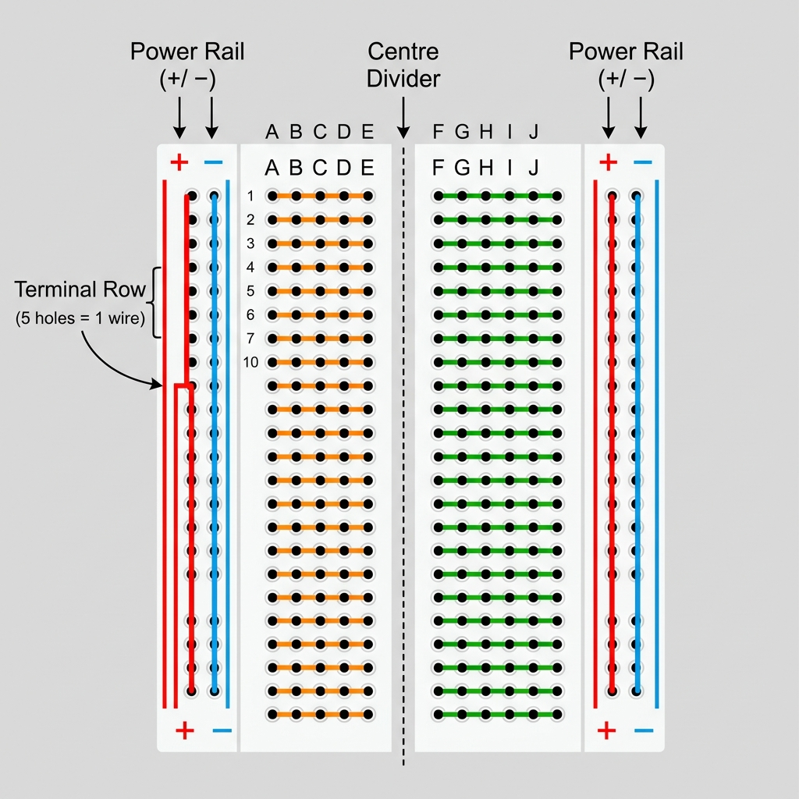

# Session 1 {.sdaia-dark background-gradient="linear-gradient(135deg, #1C355E, #00C9A7)"}

Circuits Basics — From Water Pipes to Computer Logic

## Agenda

- **Part 1** — The Water World
- **Part 2** — Zooming In
- **Part 3** — The Bridge (Water ↔ Electrons)
- **Part 4** — But They Don't Touch
- **Part 5** — Ohm's Law: V = I × R
- **Part 6** — Components: Bulb, Motor, Switch
- **Part 7** — Variable Resistance & The Transistor
- **Part 8** — 0s, 1s, and MicroPython
- **Part 9** — The Lab: Traffic Light & Automatic Light
- **Part 10** — Summary, Homework & AI Onboarding


# Part 1 — The Water World {.sdaia-dark background-gradient="linear-gradient(135deg, #1C355E, #00C9A7)"}

## Macro Circuit Simulation {background-color="#f7f9fc"}

<iframe src="../simulations/water_circuit/index.html"
        width="100%" height="520px"
        style="border:none; border-radius:12px;"></iframe>

*Toggle the pump. Watch the Pressure (Voltage) and Flow (Current) gauges.*

## The Closed Loop

::::: {.columns}

:::: {.column width="60%"}

<br>

::: {.fragment}

- **The pump** creates **pressure** — it pushes the water

:::

::: {.fragment}

- **The water moving** is the **flow**

:::

::: {.fragment}

- **The narrow part of the pipe** is **resistance** — it fights the flow

:::

::: {.callout-note .fragment}

## These three are always connected.
You cannot change one without affecting the others.

:::

::::

:::: {.column width="40%"}

::: {.fragment}

{width="100%"}

:::

::: {.fragment}

- ↑ Pressure → ↑ Flow
- ↑ Resistance → ↓ Flow

:::

::::

:::::

## Series vs. Parallel Pipes

::::: {.columns}

:::: {.column width="55%"}

::: {.fragment}

- **Series**: Pipes connected in a **single line**.
  - All water must pass through *every* pipe.
  - **Same Flow** throughout the line.
  - Pressure is shared between them.

:::

::: {.fragment}

- **Parallel**: Pipes connected in a **branch**.
  - Water chooses a path.
  - **Flow splits** between branches.
  - **Same Pressure** at the start of each path.

:::

::::

:::: {.column width="45%"}

{width="100%"}

::::

:::::


## Exercise 1 — What do you already know? {background-color="#00C9A7" .sdaia-dark}

1. *(recall)* If I make the pipe narrower at one point, what happens to the water flow?
2. *(recall)* If I add a second pump, what happens?
3. *(recall)* If I cut the pipe somewhere, what happens?
4. *(recall)* If the pump gets stronger, what happens?

## Exercise 2 — With a partner {background-color="#00C9A7" .sdaia-dark}

1. *(apply)* You narrow the pipe *a lot*. What must the pump do to keep the same flow rate?
2. *(apply)* Someone opens ALL the valves at once. What happens to the flow at each valve?
3. *(design)* What happens to the pressure just *before* a sudden narrowing in the pipe?


# Part 2 — Zooming In {.sdaia-dark background-gradient="linear-gradient(135deg, #1C355E, #00C9A7)"}

## Micro Pump Simulation {background-color="#f7f9fc"}

<iframe src="../simulations/water_circuit/micro/pump.html"
        width="100%" height="520px"
        style="border:none; border-radius:12px;"></iframe>

*Zoom into the pump impeller. Watch individual particles collide and push each other.*

## What the Molecules Are Telling You

::::: {.columns}

:::: {.column width="55%"}

::: {.fragment}

- Water is not a smooth fluid — it is **discrete molecules** crowding and pushing

:::

::: {.fragment}

- **Pressure** is the density of those collisions piling up behind a blockage

:::

::: {.fragment}

- **Flow** is the net drift direction of all those tiny pushes

:::

::: {.fragment}

- **Resistance** is energy lost to collisions with the pipe wall — the narrower the pipe, the more collisions per metre

:::

::::

:::: {.column width="45%"}

::: {.callout-tip}

## Why this matters for electrons
Current is not a fluid either. It is a **wave of pushes** through particles already packed into the wire. The pump doesn't create them — it just gives them a direction.

:::

::::

:::::

## Exercise 3 — Molecule Thinking {background-color="#00C9A7" .sdaia-dark}

1. *(recall)* If you squeeze the pipe (add resistance), which molecules get squeezed first — the ones just after the pump, or the ones far away?

2. *(apply)* If you completely block the pipe, the pump is still running. What happens to the pressure just before the block? What happens to the flow *everywhere*?

3. *(design)* What if the molecules were going so fast through a narrow section that the friction made them heat up? What do you think would happen to the pipe material?


# Part 3 — The Bridge {.sdaia-dark background-gradient="linear-gradient(135deg, #1C355E, #00C9A7)"}

## Water World ↔ Electron World

| Water World | | Electronics |
|---|:---:|---|
| Water molecules | → | **Electrons** |
| Pump | → | **Battery / power supply** |
| Pressure | → | **Voltage** (V) |
| Flow rate | → | **Current** (A) |
| Narrow pipe | → | **Resistance** (Ω) |

::: {.callout-tip}

## Same physics. Different scale. Different particles.
The battery doesn't *create* electrons — they're already there. It just creates *pressure*.

:::

## See the Translation Live {background-color="#f7f9fc"}

<iframe src="../simulations/water_circuit/index.html"
        width="100%" height="520px"
        style="border:none; border-radius:12px;"></iframe>

*Use the Voltage and Resistance sliders. Watch Current change — exactly as in the water world.*

## Exercise 4 — Translate the Water World {background-color="#00C9A7" .sdaia-dark}

Go back to your answers from **Exercises 1 & 2**.
Translate each answer into the electron world using the table.

**Example:**

- "If I make the pipe narrower" → "If I add resistance to the circuit"
- "The flow decreases" → "The current decreases"

*(apply)* Do all your original answers. Write them in **both** languages.


# Part 4 — But They Don't Touch {.sdaia-dark background-gradient="linear-gradient(135deg, #1C355E, #00C9A7)"}

## Electromagnetic Repulsion Simulation {background-color="#f7f9fc"}

<iframe src="../simulations/water_circuit/micro/repulsion.html"
        width="100%" height="520px"
        style="border:none; border-radius:12px;"></iframe>

*Watch electrons repel each other before ever touching. Connect the battery — see the drift begin.*

## Conductors vs Insulators

::::: {.columns}

:::: {.column width="50%"}

**Conductors (e.g. copper)**

- Outer electrons are loosely bound
- They roam freely through the material
- Apply voltage → they drift together → **current flows**

::: {.callout-note}

## Why metals conduct
Metallic bonds leave outer electrons free to drift.
That freedom is exactly what makes a wire a wire.

:::

::::

:::: {.column width="50%"}

**Insulators (e.g. rubber, glass)**

- Electrons are locked tightly to their atoms
- No free electrons → no drift → **no current**

::: {.callout-warning}

## High enough voltage breaks insulators
Rip the electrons free and even air conducts.
That is lightning.

:::

::::

:::::

## Exercise 5 — Quick Discussion {background-color="#00C9A7" .sdaia-dark}

1. *(apply)* If electrons push each other without touching, why does a wire *feel* like it has resistance? Where is the "friction" really coming from?

2. *(design)* An insulator has its electrons locked tight. What would happen if you applied an extremely high voltage — high enough to rip those electrons free?
   *(Think: lightning through air.)*


# Part 5 — The Math {.sdaia-dark background-gradient="linear-gradient(135deg, #1C355E, #00C9A7)"}

## Ohm's Law {.sdaia-dark background-color="#1C355E"}

::: {.r-fit-text}

**V = I × R**

:::

## Three Forms of the Same Truth

You only need one formula — rearrange for what you don't know:

| Find | Formula | Units |
|------|---------|-------|
| **Voltage** | V = I × R | Volts (V) |
| **Current** | I = V / R | Amperes (A) |
| **Resistance** | R = V / I | Ohms (Ω) |

> If pressure goes up and resistance stays the same, flow increases.
> Same physics. Same formula.

## Ohm's Law Sandbox {background-color="#f7f9fc"}

<iframe src="../simulations/water_circuit/index.html"
        width="100%" height="520px"
        style="border:none; border-radius:12px;"></iframe>

*Calculate a target Current first. Then adjust the Voltage and Resistance sliders — does the gauge match your math?*

## Exercise 6 — Ohm's Law Practice {background-color="#00C9A7" .sdaia-dark}

Show your calculation — don't just write the answer.

1. *(recall)* A battery provides **5V**. A resistor of **100Ω** is connected. How much current flows?

2. *(apply)* A circuit has **12V** and the current is **0.1A**. What is the resistance?

3. *(design)* **Challenge:** If you *halve* the resistance in a circuit with fixed voltage, what happens to the current? If you *double* the resistance — what happens?


# Part 6 — Components {.sdaia-dark background-gradient="linear-gradient(135deg, #1C355E, #00C9A7)"}

## Micro Light Bulb Simulation {background-color="#f7f9fc"}

<iframe src="../simulations/water_circuit/micro/lightbulb.html"
        width="100%" height="520px"
        style="border:none; border-radius:12px;"></iframe>

*Watch particles squeeze through the jagged filament. As they collide they turn orange/red. At high pressure, the whole area glows.*

## The Light Bulb

::::: {.columns}

:::: {.column width="55%"}

Inside a bulb: a **filament** — a very thin, very resistive wire (tungsten).

- Electrons squeeze through the narrow filament
- Constant collisions with tungsten atoms → **friction** → **heat**
- Filament reaches ~**2,500°C** → glows → **light**

::: {.callout-important}

## The weakest, most resistive part always heats the most.
This is why LEDs need resistors. Without one: low resistance + fixed voltage = enormous current → burnout in milliseconds.

:::

::::

:::: {.column width="45%"}

Narrow pipe → friction → heat → glow

Same physics as the water world.

::::

:::::

## The LED (Light Emitting Diode)

::::: {.columns}

:::: {.column width="55%"}

::: {.fragment}

- An LED is a **One-Way Check Valve**.
- It only allows current to flow in **one direction**.
- If connected backward, the "valve" shuts tight → **Zero Flow**.

:::

::: {.callout-tip}

## Identification
- **Long Leg** = Positive (+)
- **Short Leg** (and flat side of plastic) = Negative (−)
- Current must flow from **+ to −**.

:::

::::

:::: {.column width="45%"}

{width="100%"}

::::

:::::


## Exercise 7 — The Broken Circuit Scenario {background-color="#00C9A7" .sdaia-dark}


A student wires an LED directly to **3.3V** with no resistor. The LED has a resistance of ~**10Ω** when lit.

1. *(recall)* Using I = V/R, calculate how much current flows. *(The answer will shock you.)*
2. *(recall)* The LED is rated for a maximum of **30mA**. What happens?
3. *(apply)* Why does a tungsten filament survive high temperatures but an LED doesn't?
4. *(design)* Design the safe version: what resistor limits current to **20mA**?
   *(V = 3.3V, LED voltage drop = 2V)*

## Micro Motor Simulation {background-color="#f7f9fc"}

<iframe src="../simulations/water_circuit/micro/motor.html"
        width="100%" height="520px"
        style="border:none; border-radius:12px;"></iframe>

*Watch electrons (particles) interact with the magnetic armature. North (Red) and South (Blue) poles are pushed and pulled by the moving charge.*

## The Motor

::::: {.columns}

:::: {.column width="55%"}

- Moving electrons create a **magnetic field**
- Inside the motor: permanent magnets on the outside, electromagnets (coils) on the inside
- Current through coils → magnetic field → **interacts with permanent magnets**
- Opposite poles attract → like poles repel → **rotation**
- Current flips direction at the right moment → poles flip → constant push-pull → continuous spin

::::

:::: {.column width="45%"}

**Flow → Magnetic Force → Motion**

```
Electrons moving
     ↓
Magnetic field created
     ↓
EM force on magnets
     ↓
Rotation
```

::::

:::::

## The Switch

::::: {.columns}

:::: {.column width="55%"}

A switch is a **gap in the circuit** that can be opened or closed.

- **Closed** (switch on): complete path → current flows
- **Open** (switch off): broken loop → current = zero

::: {.callout-note}

## Voltage without current
When a switch is open, **voltage still exists** across the gap.
That is why you can measure it with a multimeter.
Current requires a **complete path** — voltage does not.

:::

::::

:::: {.column width="45%"}

```
Pump running   → Voltage exists
Loop complete  → Current flows
Loop broken    → Current = 0
```

::::

:::::

## Exercise 8 — Component Translation {background-color="#00C9A7" .sdaia-dark}

*(apply)* Complete the table:

| Situation | Water world | Electron world |
|-----------|-------------|----------------|
| Water flows fast through thin pipe, pipe gets warm | Friction between molecules and pipe wall | ? |
| Open valve stops all flow | ? | Switch in open position |
| Paddle wheel converts flow to rotation | Water pressure turns the paddle | ? |
| A section so narrow it melts | ? | LED with no resistor |


# Part 7 — The Valve {.sdaia-dark background-gradient="linear-gradient(135deg, #1C355E, #00C9A7)"}

## Variable Resistance: The Potentiometer

- A **valve** in cross-section: a disc with a hole — rotate it to partially block flow
- In electronics: a **potentiometer** has a resistive strip + sliding wiper
- Move the wiper → change the resistance → change the current

**Where you see this:**
Volume knobs · Brightness dimmers · Steering sensitivity controls

| Position | Resistance | Current |
|----------|-----------|---------|
| Fully open | 0 Ω | Maximum |
| Midpoint | ~250 Ω | Medium |
| Fully closed | ∞ Ω | Zero |

## The Valve Simulation {background-color="#f7f9fc"}

<iframe src="../simulations/water_circuit/micro/valve.html"
        width="100%" height="520px"
        style="border:none; border-radius:12px;"></iframe>

*Manually rotate the valve. Watch the current change in real time.*

## The Automatic Valve: The Transistor

::::: {.columns}

:::: {.column width="50%"}

**Manual Valve (Potentiometer)**

- You turn it by hand
- Analog: smooth range of values
- Input: your hand

::::

:::: {.column width="50%"}

**Transistor**

- *Electricity* turns it — automatically
- A tiny **Base** current controls a huge **Collector** current
- **1 mA Base → 200 mA Collector** (gain = 200×)
- Input: another electron signal

::::

:::::

> "A tiny trickle opens the main floodgate."
> This is **amplification** — and it is also **logic**.

## Transistors Make Logic

- Transistor **fully ON** → effectively zero resistance → current flows → **"1"**
- Transistor **fully OFF** → enormous resistance → no current → **"0"**

Chain two transistors together:

| Input A | Input B | Output |
|---------|---------|--------|
| OFF (0) | OFF (0) | 0 |
| ON (1) | OFF (0) | 0 |
| OFF (0) | ON (1) | 0 |
| **ON (1)** | **ON (1)** | **1** ← both transistors ON → current path complete → output = 1 |

You just built an **AND gate**. A billion of these = a CPU.

## Exercise 9 — Design a Circuit {background-color="#00C9A7" .sdaia-dark}

You have: **5V** supply · LED (20mA, 2V drop) · Potentiometer (0–500Ω) · Fixed 150Ω resistor

1. *(recall)* Potentiometer at **0Ω**: what current flows through the LED? *(Use V = 3V, deducting the LED's 2V)*
2. *(apply)* Potentiometer at **500Ω**: what current flows?
3. *(apply)* What does the LED *do* as you slowly rotate from 0 to 500Ω?
4. *(design)* At what potentiometer value does current drop below the LED's minimum threshold (**5mA**)?

## Exercise 10 — Transistor Thinking {background-color="#00C9A7" .sdaia-dark}

1. *(recall)* A transistor has a **gain of 200**. You apply **0.5mA** to the Base. How much current flows through the Collector?

2. *(apply)* You want to control a **500mA motor** using a Raspberry Pi GPIO pin (**max 16mA**). Is this possible? What is the transistor's role?

3. *(apply)* A transistor is either fully ON (0.1Ω) or fully OFF (1,000,000Ω). Which state is "1" and which is "0"?

4. *(design)* **Thought experiment:** You chain two transistors so the output of the first controls the Base of the second. What are the four input combinations? What logical operation have you built?


# Part 8 — 0s, 1s, and MicroPython {.sdaia-dark background-gradient="linear-gradient(135deg, #1C355E, #00C9A7)"}

## The Ladder of Abstraction

From transistors to Python — five rungs:

1. **Voltage** — above ~2V = HIGH (1), below ~0.8V = LOW (0)
2. **Binary** — 1 bit = on/off · 8 bits = 1 byte = 256 values
3. **Machine Code** — patterns of 0s and 1s the processor reads directly
4. **Assembly / C** — human-readable commands, *compiled* to machine code
5. **Python** — one line = hundreds of machine instructions, *interpreted* in real time

::: {.callout-tip}

## Python is not what the computer runs
Python is translated — layer by layer — into the 0s and 1s that transistors actually process.

:::

## Machines Need Everything Defined

The machine has no common sense. You define everything:

```python
from machine import Pin

led = Pin(17, Pin.OUT)  # "GP17 is an output — give it a name"
led.value(1)            # "set GP17 HIGH (3.3V)"
```

- Forget `Pin.OUT`? The pin defaults to input — your LED won't light.

> **Precision is the machine's strength. Common sense is yours.**

## Exercise 11 — Reading Code Like a Machine {background-color="#00C9A7" .sdaia-dark}

Read this script exactly as the processor does — line by line, top to bottom, no skipping:

```python
from machine import Pin
import time

led_a = Pin(17, Pin.OUT)   # GP17 is an output
led_b = Pin(18, Pin.OUT)   # GP18 is an output

led_a.value(1)             # GP17 HIGH
time.sleep(1)
led_a.value(0)             # GP17 LOW
led_b.value(1)             # GP18 HIGH
time.sleep(0.5)
led_b.value(0)             # GP18 LOW
```

1. *(recall)* How many GP pins does this script use?
2. *(recall)* Are they inputs or outputs?
3. *(apply)* Describe in plain language what this script does, step by step.
4. *(apply)* What is the difference between `Pin.OUT` and `Pin.IN`? What would happen if you forgot `Pin.OUT`?
5. *(design)* **Modify it:** How would you make GP17's LED blink **3 times** before GP18 turns on?

## The Full Stack in One Breath

You just held the entire stack in your head at once:

```
Pump pushes water          →  Battery pushes electrons
Pressure builds            →  Voltage (V)
Water flows through pipe   →  Current (A) through wire
Narrow pipe resists        →  Resistance (Ω) — V = I × R
Valve opens / closes       →  Transistor switches ON / OFF
Valve fully open = flow    →  Transistor ON = 1
Valve fully closed = no flow → Transistor OFF = 0
Billions of 0s and 1s      →  Machine code
Machine code interpreted   →  Python
Python line executes       →  led.value(1) → 3.3V on GP17
```

**One pump. One pipe. One Python line. Same physics all the way down.**


# Part 9 — The Lab {.sdaia-dark background-gradient="linear-gradient(135deg, #1C355E, #00C9A7)"}

## Meet the Breadboard

::::: {.columns}

:::: {.column width="60%"}

A breadboard lets you build circuits **without soldering** — perfect for experimenting safely.

::: {.fragment}

- **Power rails** (long side columns, + and −) — connect to **3.3V** and **GND**

:::

::: {.fragment}

- **Terminal rows** (short horizontal rows, A–E / F–J) — each row of 5 holes is **one wire**

:::

::: {.fragment}

- **Centre divider** — separates left and right; designed to straddle chips

:::

::::

:::: {.column width="40%"}

{width="100%"}

::: {.callout-note}

## The golden rule
Same row = same wire. Different row = different wire.

:::

::::

:::::

## Build #1 — Calculate Before You Wire

Before connecting anything, calculate the **safe resistor** for each LED.

::: {.fragment}

| | Value |
|---|---|
| Pico supply voltage | **3.3 V** |
| LED forward voltage | **2.0 V** |
| Voltage across resistor | **3.3 − 2.0 = 1.3 V** |
| Target current | **10 mA = 0.01 A** |
| **Resistor needed** | **R = 1.3 / 0.01 = 130 Ω** |

:::

::: {.fragment}

::: {.callout-tip}

## Closest standard value: **150 Ω** ✓
Slightly higher = slightly less current = LED lives longer. Never go lower.

:::

:::

## Build #1 — Traffic Light on Wokwi {background-color="#f7f9fc"}

<iframe src="https://wokwi.com/projects/460324970731475969/embed"
        width="100%" height="520px"
        style="border:none; border-radius:12px;"
        allowfullscreen></iframe>

*Build this circuit in Wokwi. Run it. Does the sequence match your code?*

## Build #1 — MicroPython Code

```python
from machine import Pin
import time

# Define each LED
red    = Pin(1, Pin.OUT)   # GP1 = Red
yellow = Pin(2, Pin.OUT)   # GP2 = Yellow
green  = Pin(3, Pin.OUT)   # GP3 = Green

while True:
    red.value(1);    time.sleep(5)   # Red ON for 5 s
    red.value(0)
    yellow.value(1); time.sleep(2)   # Yellow ON for 2 s
    yellow.value(0)
    green.value(1);  time.sleep(5)   # Green ON for 5 s
    green.value(0)
```


## Extend It with AI {background-color="#00C9A7" .sdaia-dark}

Your traffic light works. Now **ask AI to extend it.**

> *"I have a MicroPython script cycling Red → Yellow → Green on a Raspberry Pi Pico.*
> *I want to add a button on GP15 that, when held, keeps the green light on for 10 s instead of 5 s.*
> *Show me the updated code and explain what changed."*


## Build #2 — The Voltage Divider

How does a **light sensor** become a number the Pico can read?

::::: {.columns}

:::: {.column width="55%"}

::: {.fragment}

```
3.3V ── LDR ──●── 10 kΩ ── GND
               ↑
          ADC reads here
             (GP26)
```

:::

::: {.fragment}

- LDR resistance **drops** in bright light
- Fixed 10 kΩ stays **constant**
- Midpoint voltage **rises** as LDR gets smaller

:::

::::

:::: {.column width="45%"}

::: {.callout-tip}

## Water analogy
Two resistors in series = two narrow pipes.
The pressure tap *between* them reads a fraction of total — depending on which section is narrower.

:::

::: {.fragment}

| Light level | LDR R | Midpoint V |
|---|---|---|
| Bright | ~1 kΩ | ~2.9 V |
| Dark | ~100 kΩ | ~0.3 V |

:::

::::

:::::

## Build #2 — Automatic Light on Wokwi {background-color="#f7f9fc"}

<iframe src="https://wokwi.com/projects/[AUTO_LIGHT_PROJECT_ID]/embed"
        width="100%" height="520px"
        style="border:none; border-radius:12px;"
        allowfullscreen></iframe>

*Click the LDR slider to change light level. Watch the LED respond in real time.*

## Build #2 — MicroPython Code

```python
from machine import Pin, ADC
import time

ldr = ADC(26)           # GP26 = ADC0
led = Pin(15, Pin.OUT)  # output LED on GP15

DARK_THRESHOLD = 20000  # 0–65535; tune this in class

while True:
    brightness = ldr.read_u16()      # 0 (dark) → 65535 (bright)
    if brightness < DARK_THRESHOLD:
        led.value(1)                 # dark → LED ON
    else:
        led.value(0)                 # bright → LED OFF
    time.sleep(0.1)
```

::: {.callout-note}

## `read_u16()` returns a 16-bit number
0 = 0 V (total dark) · 65535 = 3.3 V (maximum bright).
The threshold is yours to tune — that is the point.

:::

## Exercise 13 — Tune and Predict {background-color="#00C9A7" .sdaia-dark}

1. *(recall)* What voltage does `read_u16() = 32768` represent?
   *(Hint: it is half the full 3.3 V range)*

2. *(apply)* Change `DARK_THRESHOLD = 40000`. Does the LED now switch on in dimmer or brighter conditions? Why?

3. *(apply)* Add a **second green LED** on GP16 that turns ON when the room is bright. Write the extra two lines of code.

4. *(design)* The sensor reading can bounce slightly (noise). How could you use multiple readings or `time.sleep()` to make the response more stable?


# Part 10 — Bringing It All Back {.sdaia-dark background-gradient="linear-gradient(135deg, #1C355E, #00C9A7)"}

## The Master Translation Table {.smaller}

| Concept | Water Analogy | Electronics Reality |
|---------|--------------|---------------------|
| Voltage (V) | Pump pressure | Force pushing electrons |
| Current (I) | Flow rate | Electrons per second (Amperes) |
| Resistance (R) | Narrow pipe | Opposition to electron flow (Ohms) |
| Ohm's Law | P ∝ F / R | V = I × R |
| Open circuit | Cut pipe | No complete path, no current |
| Short circuit | Removed all pipes | Near-zero resistance, huge current |
| LED / Bulb | Friction heating pipe | Resistance → heat → light |
| LED Polarity | One-way check valve | Current only flows one way (+ to −) |
| Series | Pipes in a single line | Components in a single path (Same Current) |
| Parallel | Branching pipes | Components side-by-side (Same Voltage) |
| Motor | Paddle wheel | EM force drives magnets → rotation |

| Switch | Gate valve | Opens / closes the electron path |
| Variable resistor | Valve | Adjustable resistance, adjustable current |
| Transistor | Electron-controlled valve | Small current controls large current |
| Binary | Open / closed valve | HIGH / LOW voltage states |
| Python | Instructions to the pump operator | High-level language the interpreter translates |

## Homework {background-color="#1C355E" .sdaia-dark}

**Part A — Calculations**

1. A 9V battery + 270Ω resistor. What current flows?
2. A circuit draws 50mA from 5V. What is the total resistance?
3. Dim an LED to 10mA using a 3.3V GPIO pin (LED drops 2V). What resistor do you need?
4. A motor needs 500mA. Can a Pico GP pin (max 16mA) drive it directly? Use AI to explain the transistor solution.

**Part B — Observation**

Find **3 places** in your home where a reactive system turns on/off based on a sensor. For each: What is the sensor? What is the action? Write 3-line Python pseudo-code for how it might work.


# AI Onboarding — Your Lab Partner {.sdaia-dark background-gradient="linear-gradient(135deg, #1C355E, #00C9A7)"}

## 4 Ways to Use AI in This Course

In this course, AI is a **senior engineer sitting next to you** — not a replacement for thinking.

1. **Explain** — *"What does `GPIO.setmode(GPIO.BCM)` actually do? Use the water analogy."*
2. **Debug** — *"I'm getting `RuntimeError: Blue LED not found`. Here is my code and wiring description. What did I miss?"*
3. **Extend** — *"My traffic light works. How do I make the yellow light pulse slowly like a heartbeat?"*
4. **Generate** — *"Write the boilerplate to set up 3 output pins on a Raspberry Pi."*

**Setup:** Open Cursor IDE · Log in to your assigned account · First prompt: introduce yourself and ask it to help verify your Ohm's Law calculations.

## Questions? {.sdaia-dark background-gradient="linear-gradient(135deg, #1C355E, #00C9A7)"}

::: {.r-fit-text}

🙋

:::
