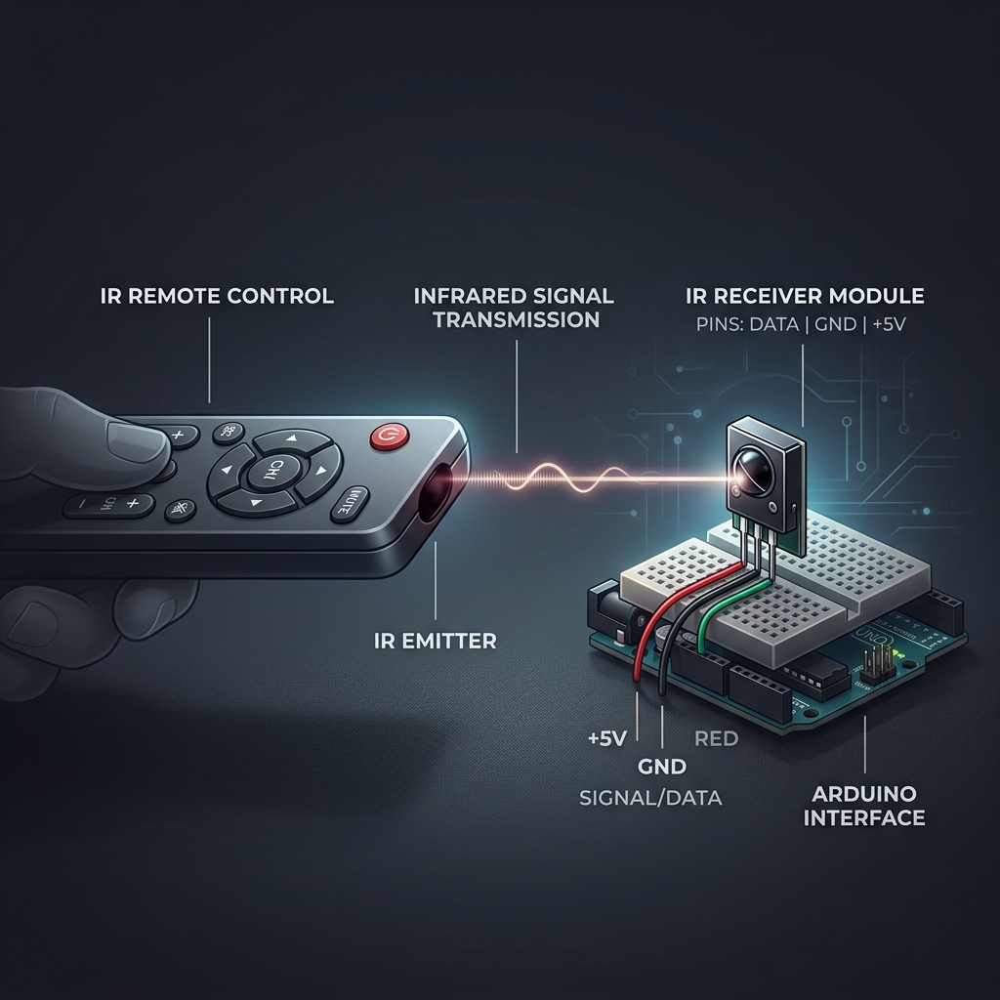

# Part 5 — The IR Remote {.sdaia-dark background-gradient="linear-gradient(135deg, #1C355E, #00C9A7)"}

## Invisible Control

How does a TV remote talk to the TV? It blinks a light that we can't see!

- **Infrared (IR)** is light with a frequency lower than red.
- Our eyes can't see it, but the robot's receiver can.
- It's like a flashlight sending a secret Morse code.

## The Hardware

To receive signals, we use an **IR Receiver Module**.

::: columns
::: {.column width="50%"}
**Connections:**

1. **GND** → GND
2. **VCC** → 5V
3. **Signal** → **Pin 2** (Digital)
:::

::: {.column width="50%"}

:::
:::

## Activity: Scanning for Codes {background-color="#00C9A7" .sdaia-dark}

Every remote is different. Before we control the car, we need to know what "Language" your remote speaks.

1. Open Arduino IDE.
2. Go to **File > Examples > IRremote > SimpleReceiver**.
3. Change `IR_RECEIVE_PIN` to **2**.
4. Open the **Serial Monitor** (115200 baud).
5. Press buttons and **write down the HEX codes** for:
   - Up Arrow
   - Down Arrow
   - Left Arrow
   - Right Arrow
   - OK / Stop

## The Logic: Decoding

Once you have your codes, we use a `switch` statement to decide what to do.

```cpp
#include <IRremote.hpp>

#define IR_RECEIVE_PIN 2

void setup() {
  Serial.begin(115200);
  IrReceiver.begin(IR_RECEIVE_PIN, ENABLE_LED_FEEDBACK);
  // ... your motor setup from Part 4 ...
}

void loop() {
  if (IrReceiver.decode()) {
    unsigned long cmd = IrReceiver.decodedIRData.decodedRawData;
    Serial.println(cmd, HEX); // See the code in the monitor
    
    handleCommand(cmd); // Custom function to move the car
    
    IrReceiver.resume(); // Ready for next signal
  }
}
```

## Creating Your Controller

Integrate the functions you wrote in **Part 4**!

```cpp
void handleCommand(unsigned long cmd) {
  switch (cmd) {
    case 0xFF18E7: // Example code for UP
      forward();
      break;
    case 0xFF4AB5: // Example code for DOWN
      backward();
      break;
    case 0xFF38C7: // Example code for OK
      stopCar();
      break;
    // Add Left and Right!
  }
}
```

::: {.callout-tip}
## Pro Tip
If your car keeps moving even after you let go of the button, it's because the IR signal was only sent once. You might need a "Stop" button or a timer!
:::
