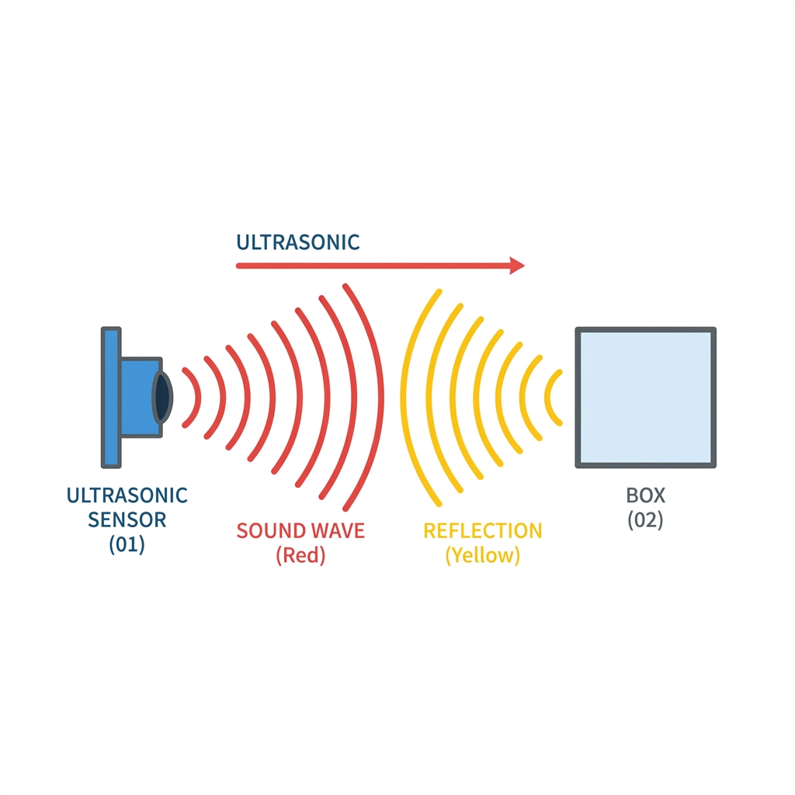
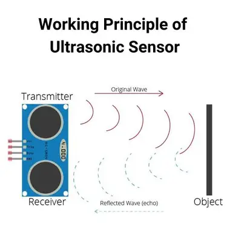
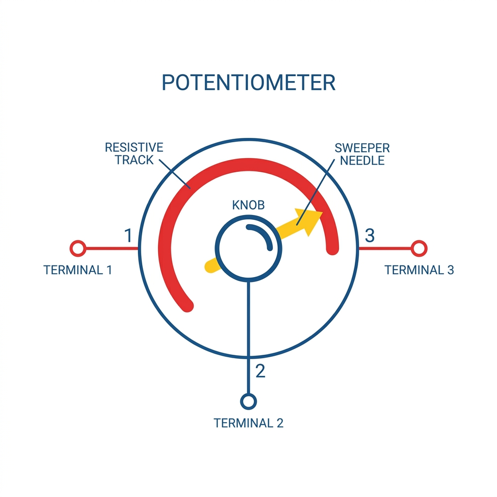

# Session 3 {.sdaia-dark background-gradient="linear-gradient(135deg, #1C355E, #00C9A7)"}

The Smarter Machine: Sensors & Servos 🧠🦾

## Today's Agenda

**Phase 1: Ultrasonic Sensors**
- Seeing like a bat 🦇
- Measuring distance & Reacting with LEDs

**Phase 2: Challenge 1: The Distance Indicator**
- Creating a 3-LED distance meter

**Phase 3: Potentiometers & Encoders**
- Reading the dial
- The position encoder idea

**Phase 4: Servo Motor Basics**
- The precise turning machine
- Wiring and sweeping

**Phase 5: Sensor + Servo Fusion**
- Building the "Radar"
- Sweeping and sensing simultaneously

**Phase 6: Final Challenge**
- The Smart Alarm / Scanner


# Phase 1: Ultrasonic Sensors {.sdaia-dark background-color="#00C9A7"}

Giving your machine "eyes".

## How does it work? 🦇

The **Ultrasonic Sensor (HC-SR04)** works like a bat's echolocation.

1. It sends out a high-frequency sound wave (**Trigger**).
2. The sound wave travels until it bounces off an object.
3. The sensor listens for the returning echo (**Echo**).

By measuring **how long** the sound takes to return, we calculate the exact distance!

{width="50%"}

## Wiring the Sensor 🔌

The sensor has 4 pins:

- **VCC:** 5V Power
- **GND:** Ground
- **Trig:** Connect to digital pin (e.g., `10`) - Sends the sound!
- **Echo:** Connect to digital pin (e.g., `11`) - Hears the sound!

## Coding Distance: The Logic

```cpp
const int trigPin = 10;
const int echoPin = 11;

void setup() {
  Serial.begin(9600); // Start serial monitor
  pinMode(trigPin, OUTPUT);
  pinMode(echoPin, INPUT);
}

void loop() {
  // We will add the logic here!
}
```

## The Distance Formula 🧮

Why is the calculation `duration * 0.034 / 2` ?

1. **Speed of Sound:** Sound travels at about **343 meters per second** (or **0.034 centimeters per microsecond**).
2. **Round Trip:** The sound pulse travels to the object AND bounces back. So, we must divide the total time by **2** to find just the distance *to* the object!

{width="60%"}

## Coding Distance: The Math

```cpp
void loop() {
  // Send a 10 microsecond pulse
  digitalWrite(trigPin, LOW);
  delayMicroseconds(2);
  digitalWrite(trigPin, HIGH);
  delayMicroseconds(10);
  digitalWrite(trigPin, LOW);

  // Measure how long the Echo pin stays HIGH
  long duration = pulseIn(echoPin, HIGH);

  // Calculate distance in cm (Speed of sound)
  int distance = duration * 0.034 / 2;
  
  Serial.print("Distance: ");
  Serial.print(distance);
  Serial.println(" cm");
  
  delay(500);
}
```

## Reacting to Distance 💡

Let's add an LED to Pin `13` and turn it ON if an object gets closer than 10 cm!

```cpp
void loop() {
  // ... (Distance Math code here) ...
  
  if (distance < 10) {
    digitalWrite(13, HIGH); // Turn LED ON
  } else {
    digitalWrite(13, LOW);  // Turn LED OFF
  }
  delay(100); // Wait a bit before next reading
}
```


# Phase 2: Challenge 1 {.sdaia-dark background-color="#E84A5F"}

The Proximity Meter 🚥

## The 3-LED Distance Indicator 🚦

**Goal:** Create a visual distance indicator using 3 LEDs (e.g., Green, Yellow, Red).

- **Green LED:** Turns on if the object is far (> 20 cm)
- **Yellow LED:** Turns on if the object is medium distance (between 10 cm and 20 cm)
- **Red LED:** Turns on if the object is very close (< 10 cm)

**Activity:** Wire 3 LEDs to different pins and write the `if / else if / else` logic!


# Phase 3: Potentiometers & Encoders {.sdaia-dark background-color="#1C355E"}

Understanding how machines know their position.

## What is a Potentiometer? 🎛️

Before we make things move, we need to understand how machines "know" where they are. 

A **Potentiometer** (or "Pot") is a dial or knob with a resistor inside. As you turn it, it changes the electrical resistance.

- **The Encoder Idea:** By reading the voltage from the middle pin, Arduino knows exactly what angle the dial is at!
- Devices use this simple trick to encode physical position into data.

{width="60%"}

## Wiring a Potentiometer

It has 3 pins:

1. **VCC (5V)** - One side
2. **GND** - The other side
3. **Signal (Analog Out)** - The middle pin. (Connect to `A0`)

## Reading the Position 👩‍💻

```cpp
void setup() {
  Serial.begin(9600); // Start the serial monitor
}

void loop() {
  int position = analogRead(A0); // Read the pin
  Serial.print("Dial Position: ");
  Serial.println(position);      // Will show a number from 0 to 1023
  delay(100);
}
```

This *exact* mechanism is hidden inside our next component...


# Phase 4: Servo Motor Basics {.sdaia-dark background-color="#1C355E"}

Precise, angle-based movement.

## What is a Servo Motor?

Unlike the DC motors that spin continuously round and round, a **Servo Motor** can be told to point at a specific angle (usually 0° to 180°).

- **Use cases:** Steering wheels, robotic arms, radar sweeps.
- **Inside:** A tiny DC motor, gears, and a potentiometer to know its exact position.

{width="40%"}

## Wiring the Servo 🔌

The SG90 micro-servo has 3 wires:

1. **Brown / Black Line:** Ground (GND)
2. **Red Line:** Power (5V)
3. **Orange / Yellow Line:** Signal (Connect to a PWM pin like `~9`)

::: {.callout-warning}
Always double-check the wire colors! Plugging power into the signal pin might damage the servo.
:::

## Coding the Servo: Setup

Arduino has a built-in library for Servos! We don't have to control the exact electrical pulses manually.

```cpp
#include <Servo.h>  // Include the library

Servo myServo;  // Create a servo object

void setup() {
  myServo.attach(9); // Tell Arduino the servo is on pin 9
}

void loop() {
  // We'll add angles here
}
```

## Pointing at Angles 📐

To make it point, we use `myServo.write(angle)`.
The angle is between 0 and 180.

```cpp
void loop() {
  myServo.write(0);      // Turn all the way right
  delay(1000);           // Wait 1 second
  
  myServo.write(90);     // Turn to the middle
  delay(1000);
  
  myServo.write(180);    // Turn all the way left
  delay(1000);
}
```
**Activity:** Let's wire this up and try making it point in 3 directions!

## The "Sweep" 🧹

What if we want it to move smoothly from 0 to 180?
We use a **`for` loop** to increase the angle slowly.

```cpp
void loop() {
  // Sweep from 0 to 180 degrees
  for (int pos = 0; pos <= 180; pos += 1) { 
    myServo.write(pos);              
    delay(15); // Wait 15ms for servo to reach position                      
  }
}
```


# Phase 5: Sensor + Servo Fusion {.sdaia-dark background-gradient="linear-gradient(135deg, #1C355E, #00C9A7)"}

Building our Radar!

## The Radar Build 📡

Now, let's physically attach the Ultrasonic Sensor to the top of the Servo horn. 

- Use a small bracket or simply some double-sided tape/rubber band if needed.
- This creates a rotating head that can "look around" the room without moving the whole base!

## The Radar Code Structure

We need to combine our two codes!

1. `#include <Servo.h>`
2. Setup Trigger, Echo, and Servo pins.
3. In `loop()`, command the servo to point to an angle (e.g., `30°`), then pulse the sensor, and print the resulting distance!

## Taking Readings in 3 Directions

```cpp
void loop() {
  // Look Left
  myServo.write(150); 
  delay(500);
  // int leftDist = measureDistance(); ...
  
  // Look Center
  myServo.write(90); 
  delay(500);
  // int centerDist = measureDistance(); ...
  
  // Look Right
  myServo.write(30); 
  delay(500);
  // int rightDist = measureDistance(); ...
}
```
*(Hint: Make the distance math a separate Helper Function!)*


# Phase 6: Final Challenge {.sdaia-dark background-color="#E84A5F"}

The Smart Alarm

## The Smart Radar Challenge 🚨

**Goal:** Create a security scanner!

1. Your radar should continuously sweep back and forth (or check 3 main positions).
2. If it detects an object closer than **15 cm**, it should "sound the alarm"!
3. *Simulate the alarm by lighting up an LED on Pin 13 or printing "INTRUDER ALERT" to the Serial Monitor rapidly.*

### Bonus (If you finish early)
- Print where the intruder is! "Intruder detected on the LEFT!"
